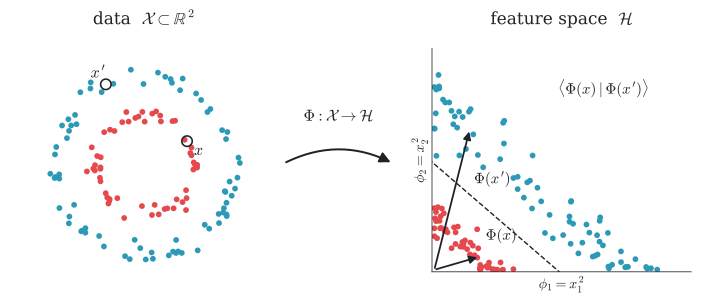

<div align="center">

<h1>Hey there, welcome! I'm Max 👋</h1>

<i>Signals 〰️, deep learning 🧠, maths 📐 and code 💻: that's my playground!</i>

<br/>

<a href="https://www.linkedin.com/in/maximilien-mahdhi"></a>


</div>

---

## ✨ About me

**What happens inside a neural network when it learns, and what structure in the data is it picking up?** That's what drives me 🔥

I'm a Franco-German applied mathematician who loves data, all the way through: **processing it** (signals, images), **understanding its structure**, **representing it** with good embeddings, and **understanding how a network learns from it**.
The maths behind these algorithms fascinates me, but I'm just as passionate about **programming**: writing clean, efficient code in Python and C++ that turns ideas into tools that actually run.
My rule of thumb: **if I can't implement it from scratch, I don't really understand it yet.**

---

## 🛠️ Toolbox

<p>


</p>

---

## 🚀 Featured projects

> 🔨 **Currently working on: `scat-vs-learned`**, scattering vs learned architectures *(full rewrite in progress)*
> Benchmarking **deep learning architectures (CNNs and beyond)** on image classification and recognition against the **scattering transform**, a CNN-like network whose filters are fixed wavelets instead of learned weights.
> The question: what do trained networks really learn, and when does learning the representation beat designing it?
> `Deep learning` `CNNs` `Image classification` `Representation learning` `Scattering transform`

<table>
<tr>
<td width="50%" valign="top">

### 🧠 [relunet](https://github.com/maximilien-mahdhi/relunet)
A **two-layer ReLU network from scratch** in pure NumPy: forward pass, backpropagation and training loop, no framework.

`Python` `NumPy` `Deep learning`

</td>
<td width="50%" valign="top">

### 〰️ [fbm-wavelets](https://github.com/maximilien-mahdhi/fbm-wavelets)
Wavelet analysis & synthesis of **fractional Brownian motion**, with Hurst exponent estimation from the scaling of wavelet coefficients.

`Python` `NumPy` `SciPy` `Wavelets`

</td>
</tr>
</table>

---

## 🔬 What I'm into

| | |
|---|---|
| 🧠 **Machine & deep learning** | Neural networks from first principles, kernel methods, why and when networks generalise |
| 🧬 **Representation learning** | Embeddings, contrastive & self-supervised learning, what makes a representation useful |
| 〰️ **Signal processing** | Wavelets, time–frequency analysis, scattering transforms |
| 🖼️ **Image processing** | Deconvolution, denoising, PSF/OTF modelling, Poisson noise |
| 🧩 **Sparsity & inverse problems** | Sparse representations, compressive sensing, regularisation |

One idea ties it all together: a model compares data through a representation $\Phi$, either **designed** from wavelets or **learned** by a deep network.

<p align="center">
<picture>
  <source media="(prefers-color-scheme: dark)" srcset="kernel_trick_dark.svg">
  <source media="(prefers-color-scheme: light)" srcset="kernel_trick_light.svg">
  
</picture>
</p>

```math
\forall\, x, x' \in \mathcal{X}, \quad k(x, x') = \big\langle \Phi(x) \,\big|\, \Phi(x') \big\rangle, \qquad \Phi \in \left\{ \begin{array}{ll} S_J & \text{wavelet scattering (designed)} \\[2pt] f_\theta & \text{deep network (learned)} \end{array} \right\}
```

That's exactly what `scat-vs-learned` puts to the test.


---

## 🧭 Where I've applied it

- 🛰️ **Airbus Defence and Space**, Toulouse: satellite image restoration (deconvolution & denoising under Poisson noise)
- 📈 **Laboratoire Jean Kuntzmann**, Grenoble: time–frequency analysis of chirp signals
- 🔩 **Infineon Technologies**, Dresden: metrology research
- 🎓 **M2 MSIAM**, Université Grenoble Alpes, *mention Très Bien*

---

## 📚 On my bookshelf

*A Wavelet Tour of Signal Processing* (Mallat) · *Imagerie spatiale* (CNES) · *Distributions, analyse de Fourier, équations aux dérivées partielles* (Golse) · *Fractional Fields and Applications* (Cohen & Istas) · *Brownian Motion, Martingales, and Stochastic Calculus* (Le Gall) · *Théorie des probabilités* (Candelpergher)

<details>
<summary><b>The full shelf</b></summary>
<br/>

**〰️ Signal & imaging**
- S. Mallat, *A Wavelet Tour of Signal Processing: The Sparse Way*, 3rd ed., Academic Press, 2009
- P. Lier, C. Valorge, X. Briottet (eds.), *Imagerie spatiale : des principes d'acquisition au traitement des images optiques pour l'observation de la Terre*, CNES / Cépaduès

**🎲 Probability & stochastic processes**
- J.-F. Le Gall, *Brownian Motion, Martingales, and Stochastic Calculus*, Springer, Graduate Texts in Mathematics 274, 2016
- S. Cohen & J. Istas, *Fractional Fields and Applications*, Springer, Mathématiques et Applications 73, 2013
- B. Candelpergher, *Théorie des probabilités : une introduction élémentaire*, Calvage & Mounet, Mathématiques en devenir, 2013

**📐 Analysis**
- F. Golse, *Distributions, analyse de Fourier, équations aux dérivées partielles*, École polytechnique
- M. Briane & G. Pagès, *Analyse. Théorie de l'intégration : convolution et transformée de Fourier*, De Boeck Supérieur, 2017
- M. & H. Queffélec, *Analyse complexe et applications*, Calvage & Mounet, 2017
- S. Benzoni-Gavage, *Calcul différentiel et équations différentielles*, 2nd ed., Dunod, 2014
- J.-P. Escofier, *Toute l'analyse de la licence*, Dunod

**🔷 Algebra**
- J. Calais, *Éléments de théorie des groupes*, PUF, 1984
- J.-P. Escofier, *Toute l'algèbre de la licence*, Dunod
- G. Berhuy, *Algèbre : le grand combat*, Calvage & Mounet, 2018

**🌀 Turbulence**
- S. B. Pope, *Turbulent Flows*, Cambridge University Press, 2000
- M. Lesieur, *La turbulence*, Presses universitaires de Grenoble, Grenoble Sciences, 1994

</details>

---

## 🌿 Beyond the code

🎹 **Piano** since 2022, big Einaudi fan · 🎾 **Tennis** in a club, fully hooked · 🎲 **Board games** like *Tzolk'in* and *Teotihuacan* · 🍳 **Cooking** · ✈️ **Travel**, in 🇫🇷 🇩🇪 🇬🇧